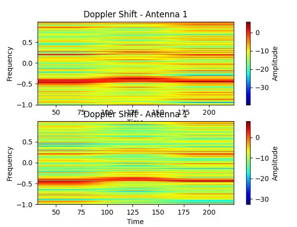

## 学习文档

本文是对https://github.com/mobicom24/RF-Diffusion 和 http://tns.thss.tsinghua.edu.cn/widar3.0/ 的学习文档，个人使用

#### 1月19日，整理一下之前的学习成果

##### 1.测试代码可行性

该扩散模型所应用的数据集是处理后的Widar3.0数据集，分为feature和condition两部分。其中feature指特征矩阵，是一个t\*90的复数双精度矩阵，t表示时间长度，90由30\*3组成，3是天线数量，30是每根天线每个时间点发送的包数。condition表示标签，分别表示“房间-手势-躯干位置-面部朝向-接收器ID-userID”（1\*6\*5\*5\*20\*6）。


使用代码提供的模型和测试数据，得到平均SSIM：


原数据与生成数据的多普勒偏移对比：



##### 2.准备数据，训练模型

对数据集进行处理，将CSI数据处理成能够传入神经网络的格式

```
data_path = 'Data\20181109\user1';
output_path = 'Output\20181109\user1';
roomID = 1;
file_list = dir(fullfile(data_path, '*.dat'));
for i = 1:length(file_list)
    name = file_list(i).name; % userID-手势-躯干位置-面部朝向-重复次数-Rx接收器id
    newName = strrep(name, '.dat', '.mat');
    file_path = fullfile(data_path, name);
    [feature, timestamp] = csi_get_all(file_path);
    disp(['Processed file: ' file_list(i).name]);

    name = strrep(name, 'user', '');  % 去除前缀 "user"
    name = strrep(name, 'r', '');  % 去除后缀 "r"
    name = strrep(name, '.dat', '');
    nameArray = strsplit(name, '-');
    cond = str2double(nameArray); 

    cond(7) = cond(1);
    cond(5) = [];
    cond(1) = roomID; % 房间-手势-躯干位置-面部朝向-接收器ID-userID
    save(fullfile(output_path, newName), 'feature', 'cond');

end
```

最终得到18000条数据，使用提供的代码和自己处理得到的数据进行训练，得到结果与上述相似。

#### 1月20日，计划使用Widar3.0的神经网络测试扩散模型对数据的增强作用

##### 1.BVP（Body-coordinate Velocity Profile）

对于该神经网络，需要再次将数据格式转为20\*20\*t的BVP形式，即：


学习从CSI到BVP的生成代码

##### 2.选择数据，梳理思路

无线感知系统是根据BVP数据来识别该CSI对应的手势。由于之前训练的扩散模型只选择了两个手势作为样本，现在将它们应用到该神经网络中，在分类数量上是没有什么说服力的。

（1）所以首先，我计划使用包含6种手势的数据集来训练一个扩散模型。

（2）然后，将上面提到的处理好的真实数据生成相同数量的合成数据。

（3）再然后，将这些CSI矩阵转化为BVP形式。

（4）最后，测试合成数据对数据集的增强效果，比较方便的一点是，在原数据集中对每个相同的条件进行了二十次重复测试，所以，计划进行六次模型训练，分别只使用真实数据，使用真实数据加二十分之四合成数据，使用真实数据加二十分之八合成数据，……，使用全部真实数据和合成数据，比较几个模型的精确度印证合成数据对无线感知系统的增强。

#### 1月21日

开始重新训练扩散模型，大概需要20个小时，期间看一下BVP的生成代码

```
for mo_sel = 1:total_mo
    for pos_sel = 1:total_pos
        for ori_sel = 1:total_ori
            for ges_sel = 1:total_ges
                spfx_ges = [dpth_people, '-', num2str(mo_sel), '-', num2str(pos_sel),...
                    '-', num2str(ori_sel), '-', num2str(ges_sel)];
                if mo_sel == start_index(1) && pos_sel == start_index(2) &&...
                        ori_sel == start_index(3) && ges_sel == start_index(4)
                    start_index_met = 1;
                end
                if start_index_met == 1
                    disp(['Running ', spfx_ges])
                    try
                        DVM_main;
                    catch err
                        disp(['Exception Occured' err.message]);
                        fprintf(exception_fid, '%s\n', spfx_ges);
                        fprintf(exception_fid, '%s\n', err.message);
                    	continue;
                    end
                else
                    disp(['Skipping ', spfx_ges])
                end
            end
        end
    end
end
```

依次遍历手势、位置等来组合文件名，随后执行主要代码块DVM_main.m

```
[doppler_spectrum, freq_bin] = get_doppler_spectrum([dpth_ges, spfx_ges],...
                    rx_cnt, rx_acnt, 'stft');
```

首先执行get_doppler_spectrum函数，用于分析无线信号多普勒效应，检测物体的运动速度和方向。输入为数据地址，接收器数量=6，每个接收器天线数=3，时频分析方法stft（短时傅里叶变换）。输出为多普勒频谱矩阵和频率索引向量。

```
% For Each Segment Do Mapping
doppler_spectrum_max = max(max(max(doppler_spectrum,[],2),[],3));
U_bound = repmat(doppler_spectrum_max, M, M);
A = get_A_matrix(torso_pos(pos_sel,:), Tx_pos, Rx_pos, rx_cnt);
VDM = permute(get_velocity2doppler_mapping_matrix(A, wave_length,...
    velocity_bin, freq_bin, rx_cnt), [2,3,1,4]);    % 20*20*rx_cnt*121
% CastM = get_CastM_matrix(A, wave_length, velocity_bin, freq_bin);
```

生成表示速度到多普勒频谱映射关系的矩阵VDM

```
seg_number = floor(size(doppler_spectrum, 3)/seg_length);
    doppler_spectrum_ges = doppler_spectrum;
    velocity_spectrum = zeros(M, M, seg_number);
    parfor ii = 1:seg_number
        % Set-up fmincon Input
        doppler_spectrum_seg = doppler_spectrum_ges(:,:,...
            (ii - 1)*seg_length+1 : ii*seg_length);
        doppler_spectrum_seg_tgt = mean(doppler_spectrum_seg, 3);
        
        % Normalization Between Receivers(Compensate Path-Loss)
        for jj = 2:size(doppler_spectrum_seg_tgt,1)
            if any(doppler_spectrum_seg_tgt(jj,:))
                doppler_spectrum_seg_tgt(jj,:) = doppler_spectrum_seg_tgt(jj,:)...
                    * sum(doppler_spectrum_seg_tgt(1,:))/sum(doppler_spectrum_seg_tgt(jj,:));
            end
        end

        % Apply fmincon Solver
        [P,fval,exitFlag,output] = fmincon(...
            @(P)DVM_target_func(P, VDM, lambda, doppler_spectrum_seg_tgt, size(doppler_spectrum_seg_tgt,1), norm),...
            zeros(M,M),...  % Initial Value
            [],[],...       % Linear Inequality Constraints
            [],[],...       % Linear Equality Constraints
            zeros(M,M),...  % Lower Bound
            U_bound,...     % Upper Bound
            [],... % @(P)DVM_nonlinear_func(P, CastM),...    % Non-linear Constraints
            optimoptions('fmincon','Algorithm','sqp',...
            'MaxFunctionEvaluations', MaxFunctionEvaluations));	% Options
        velocity_spectrum(:,:,ii) = P;
        exitFlag
    end
    
    % Rotate Velocity Spectrum According to Orientation
    velocity_spectrum_ro = get_rotated_spectrum(velocity_spectrum, torso_ori(ori_sel));
```

将多普勒频谱图根据时间分段，取平均值，接收器间进行归一化处理以补偿路径损耗，然后通过使用fmincon函数得到优化后的速度谱P。

更新，考虑到训练和处理18000条数据所需时间过多，将数据集更改为原来的四分之一，即只选择重复测量五次的数据。
